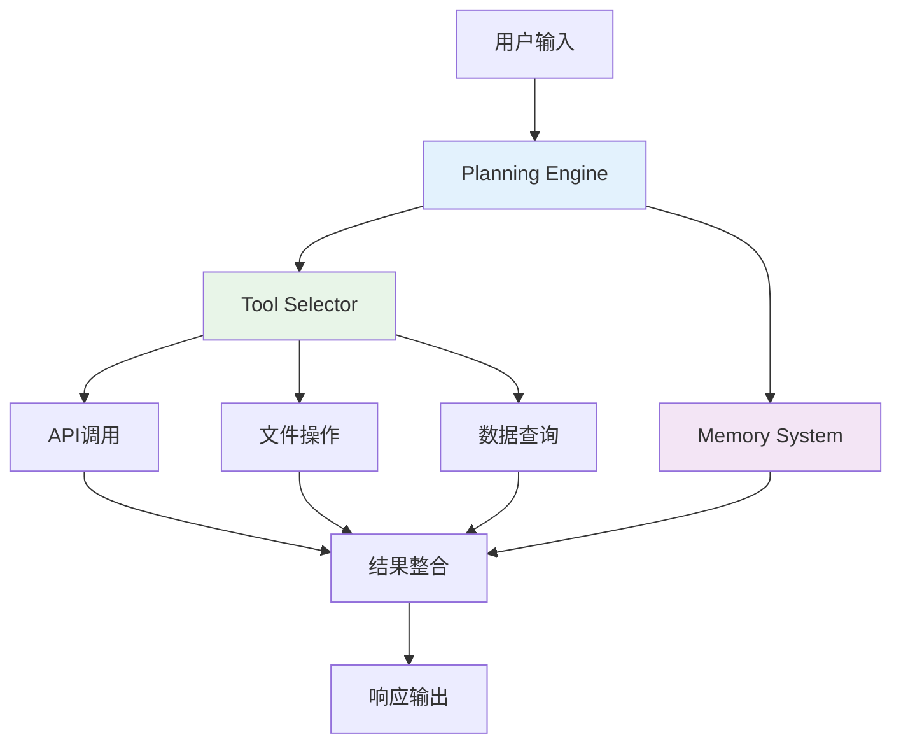

# <span class="bg-gradient-to-r from-blue-600 to-purple-600 bg-clip-text text-transparent">AI Agent</span>

<div class="text-2xl text-gray-600 font-light mb-8">
  从概念到实践的技术分享
</div>

<div class="flex items-center justify-center space-x-8 mt-12">
  <div class="w-16 h-16 bg-gradient-to-br from-blue-500 to-purple-600 rounded-2xl flex items-center justify-center">
    <span class="text-white text-2xl">🤖</span>
  </div>
  <div class="text-left">
    <div class="text-lg font-medium text-gray-800">智能代理技术</div>
    <div class="text-sm text-gray-500">Intelligent Agent Technology</div>
  </div>
</div>

<div class="absolute bottom-8 left-1/2 transform -translate-x-1/2">
  <div class="text-sm text-gray-400">按空格键开始演示</div>
</div>

<style>
.slidev-layout {
  background: linear-gradient(135deg, #f5f7fa 0%, #c3cfe2 100%);
}
</style>

---
layout: center
class: text-center
---

# 演讲大纲

<div class="grid grid-cols-2 gap-8 mt-12 max-w-4xl mx-auto">
  <div class="bg-white/80 backdrop-blur-sm rounded-2xl p-6 shadow-lg">
    <div class="w-12 h-12 bg-blue-500 rounded-xl flex items-center justify-center mx-auto mb-4">
      <span class="text-white text-xl">🧠</span>
    </div>
    <h3 class="text-lg font-semibold mb-3">认知基础</h3>
    <ul class="text-sm text-gray-600 space-y-1">
      <li>• 什么是AI Agent</li>
      <li>• 为什么需要AI Agent</li>
    </ul>
  </div>
  
  <div class="bg-white/80 backdrop-blur-sm rounded-2xl p-6 shadow-lg">
    <div class="w-12 h-12 bg-purple-500 rounded-xl flex items-center justify-center mx-auto mb-4">
      <span class="text-white text-xl">⚙️</span>
    </div>
    <h3 class="text-lg font-semibold mb-3">技术深度</h3>
    <ul class="text-sm text-gray-600 space-y-1">
      <li>• 技术架构设计</li>
      <li>• 关键实现技术</li>
    </ul>
  </div>
  
  <div class="bg-white/80 backdrop-blur-sm rounded-2xl p-6 shadow-lg">
    <div class="w-12 h-12 bg-green-500 rounded-xl flex items-center justify-center mx-auto mb-4">
      <span class="text-white text-xl">🚀</span>
    </div>
    <h3 class="text-lg font-semibold mb-3">实践应用</h3>
    <ul class="text-sm text-gray-600 space-y-1">
      <li>• 应用场景分析</li>
      <li>• LangChain4j代码演示</li>
    </ul>
  </div>
  
  <div class="bg-white/80 backdrop-blur-sm rounded-2xl p-6 shadow-lg">
    <div class="w-12 h-12 bg-orange-500 rounded-xl flex items-center justify-center mx-auto mb-4">
      <span class="text-white text-xl">🔮</span>
    </div>
    <h3 class="text-lg font-semibold mb-3">前瞻思考</h3>
    <ul class="text-sm text-gray-600 space-y-1">
      <li>• 发展趋势</li>
      <li>• 挑战与机遇</li>
    </ul>
  </div>
</div>

<style>
.slidev-layout {
  background: linear-gradient(135deg, #667eea 0%, #764ba2 100%);
}
</style>

---
layout: two-cols
layoutClass: gap-16
---

# 什么是AI Agent?

<div class="space-y-6">
  <div class="bg-white/90 backdrop-blur-sm rounded-xl p-6 shadow-md">
    <h3 class="text-lg font-semibold mb-3 text-blue-600">📖 核心定义</h3>
    <p class="text-gray-700 text-sm leading-relaxed">
      AI Agent是具备<span class="font-semibold text-blue-600">自主感知、推理决策、执行行动</span>能力的智能系统，
      能够在复杂环境中独立完成任务，并与人类或其他系统进行协作。
    </p>
  </div>

  <div class="bg-white/90 backdrop-blur-sm rounded-xl p-6 shadow-md">
    <h3 class="text-lg font-semibold mb-3 text-purple-600">🆚 传统AI vs Agent AI</h3>
    <div class="grid grid-cols-2 gap-4 text-sm">
      <div>
        <div class="font-medium text-gray-600 mb-2">传统AI</div>
        <ul class="text-gray-600 space-y-1">
          <li>• 被动响应</li>
          <li>• 单轮对话</li>
          <li>• 功能有限</li>
        </ul>
      </div>
      <div>
        <div class="font-medium text-blue-600 mb-2">Agent AI</div>
        <ul class="text-blue-600 space-y-1">
          <li>• 主动规划</li>
          <li>• 多轮协作</li>
          <li>• 工具调用</li>
        </ul>
      </div>
    </div>
  </div>
</div>

::right::

<div class="space-y-6">
  <div class="bg-gradient-to-br from-blue-50 to-purple-50 rounded-xl p-6">
    <h3 class="text-lg font-semibold mb-4 text-center">Agent核心三要素</h3>
    
    <div class="space-y-4">
      <div class="flex items-center space-x-4">
        <div class="w-12 h-12 bg-blue-500 rounded-full flex items-center justify-center">
          <span class="text-white text-lg">👁️</span>
        </div>
        <div>
          <div class="font-medium">感知 (Perception)</div>
          <div class="text-sm text-gray-600">环境状态感知与理解</div>
        </div>
      </div>
      
      <div class="flex items-center space-x-4">
        <div class="w-12 h-12 bg-purple-500 rounded-full flex items-center justify-center">
          <span class="text-white text-lg">🧠</span>
        </div>
        <div>
          <div class="font-medium">推理 (Reasoning)</div>
          <div class="text-sm text-gray-600">任务分析与策略规划</div>
        </div>
      </div>
      
      <div class="flex items-center space-x-4">
        <div class="w-12 h-12 bg-green-500 rounded-full flex items-center justify-center">
          <span class="text-white text-lg">⚡</span>
        </div>
        <div>
          <div class="font-medium">行动 (Action)</div>
          <div class="text-sm text-gray-600">工具调用与任务执行</div>
        </div>
      </div>
    </div>
  </div>

  <div class="text-center">
    <div class="inline-block bg-gradient-to-r from-blue-100 to-purple-100 rounded-lg p-4">
      <div class="text-sm text-gray-600 font-medium">
        "Agent = LLM + Planning + Memory + Tools"
      </div>
    </div>
  </div>
</div>

<style>
.slidev-layout {
  background: linear-gradient(135deg, #f8fafc 0%, #e2e8f0 100%);
}
</style>

---
layout: center
class: text-center
---

# 为什么需要AI Agent?

<div class="grid grid-cols-3 gap-8 mt-12 max-w-5xl mx-auto">
  <div class="bg-white/90 backdrop-blur-sm rounded-2xl p-6 shadow-lg border border-red-100">
    <div class="w-16 h-16 bg-gradient-to-br from-red-400 to-red-600 rounded-2xl flex items-center justify-center mx-auto mb-4">
      <span class="text-white text-2xl">🚫</span>
    </div>
    <h3 class="text-lg font-semibold mb-4 text-red-600">传统AI的局限性</h3>
    <ul class="text-sm text-gray-600 space-y-2 text-left">
      <li>• 无法处理复杂多步骤任务</li>
      <li>• 缺乏主动学习和适应能力</li>
      <li>• 无法与外部系统深度集成</li>
      <li>• 难以维持长期上下文记忆</li>
    </ul>
  </div>
  
  <div class="bg-white/90 backdrop-blur-sm rounded-2xl p-6 shadow-lg border border-blue-100">
    <div class="w-16 h-16 bg-gradient-to-br from-blue-400 to-blue-600 rounded-2xl flex items-center justify-center mx-auto mb-4">
      <span class="text-white text-2xl">📈</span>
    </div>
    <h3 class="text-lg font-semibold mb-4 text-blue-600">复杂任务需求</h3>
    <ul class="text-sm text-gray-600 space-y-2 text-left">
      <li>• 多步骤工作流程自动化</li>
      <li>• 跨系统数据整合分析</li>
      <li>• 实时决策与响应处理</li>
      <li>• 个性化服务定制需求</li>
    </ul>
  </div>
  
  <div class="bg-white/90 backdrop-blur-sm rounded-2xl p-6 shadow-lg border border-green-100">
    <div class="w-16 h-16 bg-gradient-to-br from-green-400 to-green-600 rounded-2xl flex items-center justify-center mx-auto mb-4">
      <span class="text-white text-2xl">🤝</span>
    </div>
    <h3 class="text-lg font-semibold mb-4 text-green-600">价值创造</h3>
    <ul class="text-sm text-gray-600 space-y-2 text-left">
      <li>• 效率提升：减少90%重复工作</li>
      <li>• 成本降低：24/7无间断服务</li>
      <li>• 体验优化：智能化交互界面</li>
      <li>• 创新驱动：释放人力做创造性工作</li>
    </ul>
  </div>
</div>

<div class="mt-12">
  <div class="inline-block bg-gradient-to-r from-blue-500 to-purple-600 text-white px-6 py-3 rounded-xl">
    <div class="text-lg font-medium">
      Agent是AI从"工具"向"伙伴"转变的关键技术
    </div>
  </div>
</div>

<style>
.slidev-layout {
  background: linear-gradient(135deg, #fef7f0 0%, #fed7d7 100%);
}
</style>

---
layout: two-cols
layoutClass: gap-16
---

# AI Agent技术架构

<div class="space-y-6">
  <div class="bg-white/90 backdrop-blur-sm rounded-xl p-6 shadow-md">
    <h3 class="text-lg font-semibold mb-4 text-center text-blue-600">核心架构图</h3>
    

  </div>
</div>

::right::

<div class="space-y-4">
  <div class="bg-gradient-to-br from-blue-50 to-blue-100 rounded-xl p-4">
    <h4 class="font-semibold text-blue-700 mb-2">🧠 Planning Engine</h4>
    <ul class="text-sm text-gray-700 space-y-1">
      <li>• 任务分解与步骤规划</li>
      <li>• 决策树构建与优化</li>
      <li>• 异常情况处理策略</li>
    </ul>
  </div>
  
  <div class="bg-gradient-to-br from-purple-50 to-purple-100 rounded-xl p-4">
    <h4 class="font-semibold text-purple-700 mb-2">💾 Memory System</h4>
    <ul class="text-sm text-gray-700 space-y-1">
      <li>• 短期工作记忆管理</li>
      <li>• 长期知识库存储</li>
      <li>• 上下文状态维护</li>
    </ul>
  </div>
  
  <div class="bg-gradient-to-br from-green-50 to-green-100 rounded-xl p-4">
    <h4 class="font-semibold text-green-700 mb-2">🛠️ Tool Integration</h4>
    <ul class="text-sm text-gray-700 space-y-1">
      <li>• 外部API接口调用</li>
      <li>• 数据库查询操作</li>
      <li>• 文件系统交互</li>
    </ul>
  </div>
  
  <div class="bg-gradient-to-br from-orange-50 to-orange-100 rounded-xl p-4">
    <h4 class="font-semibold text-orange-700 mb-2">⚡ Execution Engine</h4>
    <ul class="text-sm text-gray-700 space-y-1">
      <li>• 并发任务调度</li>
      <li>• 错误处理与重试</li>
      <li>• 性能监控与优化</li>
    </ul>
  </div>
</div>

<style>
.slidev-layout {
  background: linear-gradient(135deg, #e8f4fd 0%, #d1ecf1 100%);
}
</style>

---
layout: center
class: text-center
---

# 关键技术实现

<div class="grid grid-cols-2 gap-12 mt-12 max-w-6xl mx-auto">
  <div class="bg-white/90 backdrop-blur-sm rounded-2xl p-8 shadow-lg">
    <div class="w-20 h-20 bg-gradient-to-br from-blue-400 to-blue-600 rounded-2xl flex items-center justify-center mx-auto mb-6">
      <span class="text-white text-3xl">🧠</span>
    </div>
    <h3 class="text-xl font-semibold mb-6 text-blue-600">LLM驱动的推理引擎</h3>
    
    <div class="space-y-4 text-left">
      <div class="bg-blue-50 rounded-lg p-4">
        <h4 class="font-medium text-blue-700 mb-2">Prompt Engineering</h4>
        <p class="text-sm text-gray-600">系统提示词设计，角色定义，任务指令优化</p>
      </div>
      
      <div class="bg-blue-50 rounded-lg p-4">
        <h4 class="font-medium text-blue-700 mb-2">Chain of Thought</h4>
        <p class="text-sm text-gray-600">步骤化推理链条，提升复杂问题解决能力</p>
      </div>
      
      <div class="bg-blue-50 rounded-lg p-4">
        <h4 class="font-medium text-blue-700 mb-2">Function Calling</h4>
        <p class="text-sm text-gray-600">结构化工具调用，参数验证与格式化</p>
      </div>
    </div>
  </div>
  
  <div class="bg-white/90 backdrop-blur-sm rounded-2xl p-8 shadow-lg">
    <div class="w-20 h-20 bg-gradient-to-br from-purple-400 to-purple-600 rounded-2xl flex items-center justify-center mx-auto mb-6">
      <span class="text-white text-3xl">🔧</span>
    </div>
    <h3 class="text-xl font-semibold mb-6 text-purple-600">工具集成与管理</h3>
    
    <div class="space-y-4 text-left">
      <div class="bg-purple-50 rounded-lg p-4">
        <h4 class="font-medium text-purple-700 mb-2">Tool Registry</h4>
        <p class="text-sm text-gray-600">工具注册中心，统一管理可用工具集合</p>
      </div>
      
      <div class="bg-purple-50 rounded-lg p-4">
        <h4 class="font-medium text-purple-700 mb-2">Parameter Binding</h4>
        <p class="text-sm text-gray-600">智能参数绑定，类型检查与转换</p>
      </div>
      
      <div class="bg-purple-50 rounded-lg p-4">
        <h4 class="font-medium text-purple-700 mb-2">Error Handling</h4>
        <p class="text-sm text-gray-600">异常捕获处理，失败重试机制</p>
      </div>
    </div>
  </div>
</div>

<style>
.slidev-layout {
  background: linear-gradient(135deg, #f0f9ff 0%, #e0e7ff 100%);
}
</style>

---
layout: center
class: text-center
---

# LangChain4j框架介绍

<div class="grid grid-cols-2 gap-12 mt-12 max-w-6xl mx-auto">
  <div class="bg-white/90 backdrop-blur-sm rounded-2xl p-8 shadow-lg">
    <div class="w-20 h-20 bg-gradient-to-br from-green-400 to-green-600 rounded-2xl flex items-center justify-center mx-auto mb-6">
      <span class="text-white text-3xl">☕</span>
    </div>
    <h3 class="text-xl font-semibold mb-6 text-green-600">为什么选择LangChain4j</h3>
    
    <div class="space-y-4 text-left">
      <div class="bg-green-50 rounded-lg p-4">
        <h4 class="font-medium text-green-700 mb-2">🚀 原生Java支持</h4>
        <p class="text-sm text-gray-600">专为Java生态设计，无需Python依赖</p>
      </div>
      
      <div class="bg-green-50 rounded-lg p-4">
        <h4 class="font-medium text-green-700 mb-2">🔧 Spring Boot集成</h4>
        <p class="text-sm text-gray-600">完美集成Spring生态，开箱即用</p>
      </div>
      
      <div class="bg-green-50 rounded-lg p-4">
        <h4 class="font-medium text-green-700 mb-2">⚡ 高性能异步</h4>
        <p class="text-sm text-gray-600">基于CompletableFuture的异步处理</p>
      </div>
    </div>
  </div>
  
  <div class="bg-white/90 backdrop-blur-sm rounded-2xl p-8 shadow-lg">
    <div class="w-20 h-20 bg-gradient-to-br from-blue-400 to-blue-600 rounded-2xl flex items-center justify-center mx-auto mb-6">
      <span class="text-white text-3xl">🏗️</span>
    </div>
    <h3 class="text-xl font-semibold mb-6 text-blue-600">核心组件架构</h3>
    
    <div class="space-y-4 text-left">
      <div class="bg-blue-50 rounded-lg p-4">
        <h4 class="font-medium text-blue-700 mb-2">ChatLanguageModel</h4>
        <p class="text-sm text-gray-600">统一的LLM接口，支持多种模型</p>
      </div>
      
      <div class="bg-blue-50 rounded-lg p-4">
        <h4 class="font-medium text-blue-700 mb-2">AiServices</h4>
        <p class="text-sm text-gray-600">声明式Agent定义，简化开发</p>
      </div>
      
      <div class="bg-blue-50 rounded-lg p-4">
        <h4 class="font-medium text-blue-700 mb-2">Tools & Memory</h4>
        <p class="text-sm text-gray-600">丰富的工具库和记忆管理</p>
      </div>
    </div>
  </div>
</div>

<div class="mt-12">
  <div class="inline-block bg-gradient-to-r from-green-500 to-blue-600 text-white px-8 py-4 rounded-xl">
    <div class="text-lg font-medium">
      企业级Java AI应用的最佳选择
    </div>
  </div>
</div>

<style>
.slidev-layout {
  background: linear-gradient(135deg, #ecfdf5 0%, #d1fae5 100%);
}
</style>

---
layout: two-cols
layoutClass: gap-16
---

# 基础Agent实现

<div class="space-y-6">
  <div class="bg-white/90 backdrop-blur-sm rounded-xl p-6 shadow-md">
    <h3 class="text-lg font-semibold mb-4 text-blue-600">💡 实现思路</h3>
    <ul class="text-sm text-gray-700 space-y-2">
      <li>• 使用AiServices创建Agent接口</li>
      <li>• 配置ChatLanguageModel</li>
      <li>• 定义系统提示词</li>
      <li>• 处理用户输入和AI响应</li>
    </ul>
  </div>

  <div class="bg-gradient-to-br from-green-50 to-green-100 rounded-xl p-6">
    <h3 class="text-lg font-semibold mb-4 text-green-700">🎯 核心特性</h3>
    <div class="grid grid-cols-2 gap-4 text-sm">
      <div>
        <div class="font-medium text-green-600 mb-2">类型安全</div>
        <p class="text-gray-600">编译时类型检查</p>
      </div>
      <div>
        <div class="font-medium text-green-600 mb-2">声明式</div>
        <p class="text-gray-600">注解驱动开发</p>
      </div>
      <div>
        <div class="font-medium text-green-600 mb-2">Spring集成</div>
        <p class="text-gray-600">依赖注入支持</p>
      </div>
      <div>
        <div class="font-medium text-green-600 mb-2">异步处理</div>
        <p class="text-gray-600">非阻塞操作</p>
      </div>
    </div>
  </div>
</div>

::right::

```java {monaco}
// 1. 定义Agent接口
public interface ChatAgent {
    
    @SystemMessage("你是一个专业的Java开发助手，" +
                  "请用简洁准确的语言回答用户问题。")
    String chat(@UserMessage String userMessage);
}

// 2. 配置和使用
@Configuration
public class AgentConfig {
    
    @Bean
    public ChatLanguageModel chatModel() {
        return OpenAiChatModel.builder()
            .apiKey(System.getenv("OPENAI_API_KEY"))
            .modelName("gpt-4")
            .temperature(0.7)
            .build();
    }
    
    @Bean
    public ChatAgent chatAgent(ChatLanguageModel model) {
        return AiServices.builder(ChatAgent.class)
            .chatLanguageModel(model)
            .build();
    }
}

// 3. 在Controller中使用
@RestController
public class ChatController {
    
    @Autowired
    private ChatAgent chatAgent;
    
    @PostMapping("/chat")
    public String chat(@RequestBody String message) {
        return chatAgent.chat(message);
    }
}
```

<style>
.slidev-layout {
  background: linear-gradient(135deg, #f0fdf4 0%, #dcfce7 100%);
}
</style>

---
layout: center
class: text-center
---

# 工具集成演示

<div class="max-w-5xl mx-auto">
  <div class="grid grid-cols-2 gap-8 mb-8">
    <div class="bg-white/90 backdrop-blur-sm rounded-2xl p-6 shadow-lg">
      <h3 class="text-lg font-semibold mb-4 text-purple-600">🔧 @Tool注解</h3>
      <p class="text-sm text-gray-600 mb-4">通过简单的注解就能让AI调用Java方法</p>
      
```java {monaco}
@Component
public class WeatherTools {
    
    @Tool("获取指定城市的当前天气信息")
    public String getCurrentWeather(
        @P("城市名称，如：北京、上海") String city) {
        
        // 调用天气API
        WeatherData data = weatherService.getWeather(city);
        return String.format("城市：%s，温度：%d°C，天气：%s", 
                           data.getCity(), 
                           data.getTemperature(), 
                           data.getDescription());
    }
    
    @Tool("发送邮件给指定收件人")
    public String sendEmail(
        @P("收件人邮箱地址") String to,
        @P("邮件主题") String subject,
        @P("邮件内容") String content) {
        
        try {
            emailService.send(to, subject, content);
            return "邮件发送成功";
        } catch (Exception e) {
            return "邮件发送失败: " + e.getMessage();
        }
    }
}
```
    </div>
    
    <div class="bg-white/90 backdrop-blur-sm rounded-2xl p-6 shadow-lg">
      <h3 class="text-lg font-semibold mb-4 text-blue-600">🤖 Agent集成工具</h3>
      <p class="text-sm text-gray-600 mb-4">Agent自动选择合适的工具来完成任务</p>
      
```java {monaco}
// Agent接口定义
public interface AssistantAgent {
    
    @SystemMessage("你是一个智能助手，可以帮助用户" +
                  "查询天气、发送邮件等任务。")
    String assist(@UserMessage String request);
}

// 配置Agent和工具
@Bean
public AssistantAgent assistantAgent(
        ChatLanguageModel model,
        WeatherTools weatherTools) {
    
    return AiServices.builder(AssistantAgent.class)
        .chatLanguageModel(model)
        .tools(weatherTools)
        .build();
}

// 使用示例
public void demo() {
    String response = agent.assist(
        "帮我查一下北京的天气，然后把天气信息" +
        "发邮件给 john@example.com"
    );
    // AI会自动调用getCurrentWeather和sendEmail
    System.out.println(response);
}
```
    </div>
  </div>

  <div class="inline-block bg-gradient-to-r from-purple-500 to-blue-600 text-white px-6 py-3 rounded-xl">
    <div class="text-lg font-medium">AI自动选择工具，实现复杂任务编排</div>
  </div>
</div>

<style>
.slidev-layout {
  background: linear-gradient(135deg, #faf5ff 0%, #e9d5ff 100%);
}
</style>

---
layout: two-cols
layoutClass: gap-16
---

# 内存管理演示

<div class="space-y-6">
  <div class="bg-white/90 backdrop-blur-sm rounded-xl p-6 shadow-md">
    <h3 class="text-lg font-semibold mb-4 text-orange-600">🧠 记忆类型</h3>
    <div class="space-y-3">
      <div class="bg-orange-50 rounded-lg p-3">
        <h4 class="font-medium text-orange-700 mb-1">ChatMemory</h4>
        <p class="text-xs text-gray-600">对话历史记录</p>
      </div>
      <div class="bg-orange-50 rounded-lg p-3">
        <h4 class="font-medium text-orange-700 mb-1">TokenWindowMemory</h4>
        <p class="text-xs text-gray-600">固定Token数量窗口</p>
      </div>
      <div class="bg-orange-50 rounded-lg p-3">
        <h4 class="font-medium text-orange-700 mb-1">MessageWindowMemory</h4>
        <p class="text-xs text-gray-600">固定消息数量窗口</p>
      </div>
    </div>
  </div>

  <div class="bg-gradient-to-br from-blue-50 to-blue-100 rounded-xl p-6">
    <h3 class="text-lg font-semibold mb-4 text-blue-700">📊 使用场景</h3>
    <ul class="text-sm text-gray-700 space-y-2">
      <li>• 多轮对话上下文保持</li>
      <li>• 用户偏好记忆</li>
      <li>• 任务状态跟踪</li>
      <li>• 长期知识积累</li>
    </ul>
  </div>
</div>

::right::

```java {monaco}
// 1. 配置不同类型的Memory
@Configuration
public class MemoryConfig {
    
    @Bean
    public ChatMemory tokenWindowMemory() {
        return TokenWindowChatMemory.withMaxTokens(1000, 
            new OpenAiTokenizer("gpt-4"));
    }
    
    @Bean 
    public ChatMemory messageWindowMemory() {
        return MessageWindowChatMemory.withMaxMessages(20);
    }
}

// 2. 带记忆的Agent
public interface MemoryAgent {
    
    @SystemMessage("你是一个有记忆的助手，" +
                  "可以记住之前的对话内容。")
    String chat(@UserMessage String message, 
                @MemoryId String userId);
}

// 3. 配置Agent使用Memory
@Bean
public MemoryAgent memoryAgent(ChatLanguageModel model,
                              ChatMemory memory) {
    return AiServices.builder(MemoryAgent.class)
        .chatLanguageModel(model)
        .chatMemory(memory)
        .build();
}

// 4. 使用示例
@Service
public class ConversationService {
    
    @Autowired
    private MemoryAgent agent;
    
    public String handleMessage(String userId, String message) {
        // 每个用户都有独立的对话记忆
        return agent.chat(message, userId);
    }
}
```

<style>
.slidev-layout {
  background: linear-gradient(135deg, #fff7ed 0%, #fed7aa 100%);
}
</style>

---
layout: center
class: text-center
---

# 应用场景展示

<div class="grid grid-cols-3 gap-8 mt-12 max-w-6xl mx-auto">
  <div class="bg-white/90 backdrop-blur-sm rounded-2xl p-8 shadow-lg border border-blue-100">
    <div class="w-20 h-20 bg-gradient-to-br from-blue-400 to-blue-600 rounded-2xl flex items-center justify-center mx-auto mb-6">
      <span class="text-white text-3xl">💼</span>
    </div>
    <h3 class="text-xl font-semibold mb-6 text-blue-600">企业办公助手</h3>
    
    <div class="space-y-4 text-left">
      <div class="bg-blue-50 rounded-lg p-4">
        <h4 class="font-medium text-blue-700 mb-2">📄 文档处理</h4>
        <p class="text-sm text-gray-600">自动生成报告、合同审查、内容摘要</p>
      </div>
      
      <div class="bg-blue-50 rounded-lg p-4">
        <h4 class="font-medium text-blue-700 mb-2">📝 会议助手</h4>
        <p class="text-sm text-gray-600">实时记录、任务提取、行动计划</p>
      </div>
      
      <div class="bg-blue-50 rounded-lg p-4">
        <h4 class="font-medium text-blue-700 mb-2">📧 邮件管理</h4>
        <p class="text-sm text-gray-600">智能分类、自动回复、优先级排序</p>
      </div>
    </div>
  </div>
  
  <div class="bg-white/90 backdrop-blur-sm rounded-2xl p-8 shadow-lg border border-green-100">
    <div class="w-20 h-20 bg-gradient-to-br from-green-400 to-green-600 rounded-2xl flex items-center justify-center mx-auto mb-6">
      <span class="text-white text-3xl">💻</span>
    </div>
    <h3 class="text-xl font-semibold mb-6 text-green-600">开发助手Agent</h3>
    
    <div class="space-y-4 text-left">
      <div class="bg-green-50 rounded-lg p-4">
        <h4 class="font-medium text-green-700 mb-2">🔍 代码审查</h4>
        <p class="text-sm text-gray-600">静态分析、安全扫描、最佳实践检查</p>
      </div>
      
      <div class="bg-green-50 rounded-lg p-4">
        <h4 class="font-medium text-green-700 mb-2">🧪 测试生成</h4>
        <p class="text-sm text-gray-600">单元测试、集成测试、边界用例</p>
      </div>
      
      <div class="bg-green-50 rounded-lg p-4">
        <h4 class="font-medium text-green-700 mb-2">📚 文档生成</h4>
        <p class="text-sm text-gray-600">API文档、用户手册、技术规范</p>
      </div>
    </div>
  </div>
  
  <div class="bg-white/90 backdrop-blur-sm rounded-2xl p-8 shadow-lg border border-purple-100">
    <div class="w-20 h-20 bg-gradient-to-br from-purple-400 to-purple-600 rounded-2xl flex items-center justify-center mx-auto mb-6">
      <span class="text-white text-3xl">🎧</span>
    </div>
    <h3 class="text-xl font-semibold mb-6 text-purple-600">智能客服机器人</h3>
    
    <div class="space-y-4 text-left">
      <div class="bg-purple-50 rounded-lg p-4">
        <h4 class="font-medium text-purple-700 mb-2">💬 多轮对话</h4>
        <p class="text-sm text-gray-600">上下文理解、意图识别、情感分析</p>
      </div>
      
      <div class="bg-purple-50 rounded-lg p-4">
        <h4 class="font-medium text-purple-700 mb-2">📋 知识查询</h4>
        <p class="text-sm text-gray-600">FAQ检索、产品信息、政策解答</p>
      </div>
      
      <div class="bg-purple-50 rounded-lg p-4">
        <h4 class="font-medium text-purple-700 mb-2">🎫 工单处理</h4>
        <p class="text-sm text-gray-600">问题分类、优先级评估、自动流转</p>
      </div>
    </div>
  </div>
</div>

<style>
.slidev-layout {
  background: linear-gradient(135deg, #f8fafc 0%, #e2e8f0 100%);
}
</style>

---
layout: center
class: text-center
---

# 发展趋势与机遇

<div class="grid grid-cols-2 gap-12 mt-12 max-w-6xl mx-auto">
  <div class="bg-white/90 backdrop-blur-sm rounded-2xl p-8 shadow-lg">
    <div class="w-20 h-20 bg-gradient-to-br from-indigo-400 to-indigo-600 rounded-2xl flex items-center justify-center mx-auto mb-6">
      <span class="text-white text-3xl">🚀</span>
    </div>
    <h3 class="text-xl font-semibold mb-6 text-indigo-600">技术发展趋势</h3>
    
    <div class="space-y-4 text-left">
      <div class="bg-indigo-50 rounded-lg p-4">
        <h4 class="font-medium text-indigo-700 mb-2">🤝 多Agent协作</h4>
        <p class="text-sm text-gray-600">专业化分工，协同完成复杂任务</p>
      </div>
      
      <div class="bg-indigo-50 rounded-lg p-4">
        <h4 class="font-medium text-indigo-700 mb-2">🎯 垂直领域专业化</h4>
        <p class="text-sm text-gray-600">医疗、金融、法律等专业Agent</p>
      </div>
      
      <div class="bg-indigo-50 rounded-lg p-4">
        <h4 class="font-medium text-indigo-700 mb-2">🌐 Agent生态建设</h4>
        <p class="text-sm text-gray-600">统一标准、插件市场、云服务</p>
      </div>
    </div>
  </div>
  
  <div class="bg-white/90 backdrop-blur-sm rounded-2xl p-8 shadow-lg">
    <div class="w-20 h-20 bg-gradient-to-br from-rose-400 to-rose-600 rounded-2xl flex items-center justify-center mx-auto mb-6">
      <span class="text-white text-3xl">⚠️</span>
    </div>
    <h3 class="text-xl font-semibold mb-6 text-rose-600">挑战与应对</h3>
    
    <div class="space-y-4 text-left">
      <div class="bg-rose-50 rounded-lg p-4">
        <h4 class="font-medium text-rose-700 mb-2">🔒 安全性挑战</h4>
        <p class="text-sm text-gray-600">权限控制、数据隐私、恶意使用</p>
      </div>
      
      <div class="bg-rose-50 rounded-lg p-4">
        <h4 class="font-medium text-rose-700 mb-2">💰 成本与性能</h4>
        <p class="text-sm text-gray-600">API调用费用、响应时延、资源优化</p>
      </div>
      
      <div class="bg-rose-50 rounded-lg p-4">
        <h4 class="font-medium text-rose-700 mb-2">🎛️ 可控性问题</h4>
        <p class="text-sm text-gray-600">行为预测、错误处理、人工干预</p>
      </div>
    </div>
  </div>
</div>

<div class="mt-12">
  <div class="inline-block bg-gradient-to-r from-indigo-500 to-rose-600 text-white px-8 py-4 rounded-xl">
    <div class="text-lg font-medium">
      循序渐进，重视安全，拥抱AI Agent时代
    </div>
  </div>
</div>

<style>
.slidev-layout {
  background: linear-gradient(135deg, #f1f5f9 0%, #e2e8f0 100%);
}
</style>

---
layout: center
class: text-center
---

# 关键要点回顾

<div class="max-w-4xl mx-auto mt-12">
  <div class="grid grid-cols-2 gap-8">
    <div class="bg-white/90 backdrop-blur-sm rounded-2xl p-6 shadow-lg">
      <h3 class="text-lg font-semibold mb-4 text-blue-600">🧠 核心概念</h3>
      <ul class="text-sm text-gray-700 space-y-2 text-left">
        <li>• AI Agent = LLM + Planning + Memory + Tools</li>
        <li>• 从被动响应到主动规划的转变</li>
        <li>• 自主感知、推理决策、执行行动</li>
      </ul>
    </div>
    
    <div class="bg-white/90 backdrop-blur-sm rounded-2xl p-6 shadow-lg">
      <h3 class="text-lg font-semibold mb-4 text-green-600">☕ LangChain4j优势</h3>
      <ul class="text-sm text-gray-700 space-y-2 text-left">
        <li>• 原生Java支持，Spring生态集成</li>
        <li>• 声明式开发，@Tool注解简化集成</li>
        <li>• 丰富的Memory管理和异步处理</li>
      </ul>
    </div>
    
    <div class="bg-white/90 backdrop-blur-sm rounded-2xl p-6 shadow-lg">
      <h3 class="text-lg font-semibold mb-4 text-purple-600">🚀 应用价值</h3>
      <ul class="text-sm text-gray-700 space-y-2 text-left">
        <li>• 办公自动化、开发助手、智能客服</li>
        <li>• 效率提升90%，24/7无间断服务</li>
        <li>• 释放人力做更有创造性的工作</li>
      </ul>
    </div>
    
    <div class="bg-white/90 backdrop-blur-sm rounded-2xl p-6 shadow-lg">
      <h3 class="text-lg font-semibold mb-4 text-orange-600">💡 实施建议</h3>
      <ul class="text-sm text-gray-700 space-y-2 text-left">
        <li>• 从简单场景开始，逐步复杂化</li>
        <li>• 重视安全性和可控性设计</li>
        <li>• 建立监控和人工干预机制</li>
      </ul>
    </div>
  </div>
  
  <div class="mt-12">
    <div class="bg-gradient-to-r from-blue-500 to-purple-600 text-white rounded-2xl p-8">
      <h2 class="text-2xl font-bold mb-4">🎯 Q&A 互动环节</h2>
      <p class="text-lg opacity-90">欢迎大家提问，一起探讨AI Agent的技术实现和应用场景</p>
      
      <div class="grid grid-cols-3 gap-6 mt-6 text-sm">
        <div class="bg-white/20 rounded-lg p-4">
          <div class="font-medium mb-2">技术实现</div>
          <div class="opacity-80">架构设计、工具集成、性能优化</div>
        </div>
        <div class="bg-white/20 rounded-lg p-4">
          <div class="font-medium mb-2">应用场景</div>
          <div class="opacity-80">业务集成、成本效益、实施路径</div>
        </div>
        <div class="bg-white/20 rounded-lg p-4">
          <div class="font-medium mb-2">未来发展</div>
          <div class="opacity-80">技术趋势、挑战应对、商业机会</div>
        </div>
      </div>
    </div>
  </div>
</div>

<style>
.slidev-layout {
  background: linear-gradient(135deg, #fef3c7 0%, #fde68a 100%);
}
</style>

